# 阿里翻译

> 教程来源于[划词翻译](https://hcfy.app/)，一个很棒的网页翻译插件

> 文档内容可能会过时，请以百度翻译官网说明为准。

## 价格

阿里翻译每月的前 100 万字符免费，超出的部分会按照 50 元 / 百万字符收取费用，费用由阿里翻译在它自己的阿里云官方网站收取，与 pot 无关。

阿里翻译是按天计费的，建议前往阿里云的费用中心充值 1 元，并设置可用额度预警为 1 元，这样当天扣费时会有短信提醒。但是请注意，按天计费意味着在一天之内即使用完了余额也会继续扣费，只会在每天结算的时候（一般是凌晨一点）才会有提醒。

## 申请步骤

### 第一步：开通通用版翻译引擎

打开阿里云通用版翻译引擎首页，点击【立即开通】按钮，登录之后会进入机器翻译管理控制台并看到如下界面，然后点击【通用版翻译引擎】下方的【立即开通】按钮。

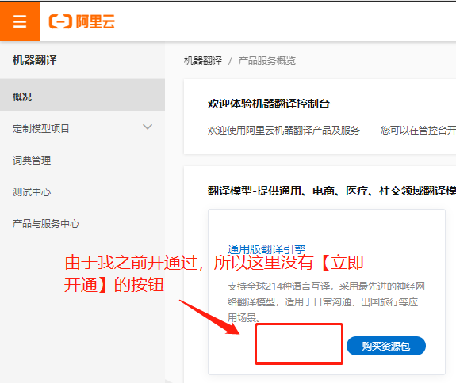

点击之后会让你勾选一个【机器翻译服务协议】，勾选之后点【立即开通】就能开通成功了。

### 第二步：创建 AccessKey

开通之后，回到阿里云机器翻译管理控制台，把鼠标移动到页面右上角的头像上悬停，然后点击【AccessKey 管理】，会跳转到 AccessKey 管理页面。

进入后会弹出一个安全提示：

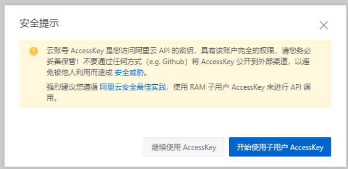

简而言之，在这里创建的 AccessKey 能调用你账号下的所有资源，权限范围太大了，一旦泄露的话影响面很大，所以阿里云建议你创建一个子用户，然后给这个子用户只分配机器翻译的权限，这样的话即使泄露了也只会影响到机器翻译。

使用云账号 AccessKey（更便捷，但不保险）

如果要用云账号创建 AccessKey，那么选择【继续使用 AccessKey】即可。

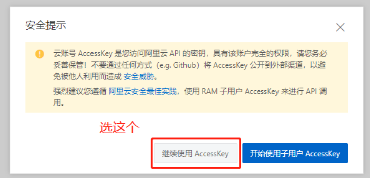

然后点击【创建 AccessKey】按钮：

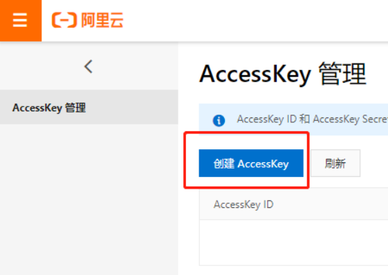

点击之后会让你输入手机短信验证码，输入之后会提示 AccessKey 创建成功，如下图：

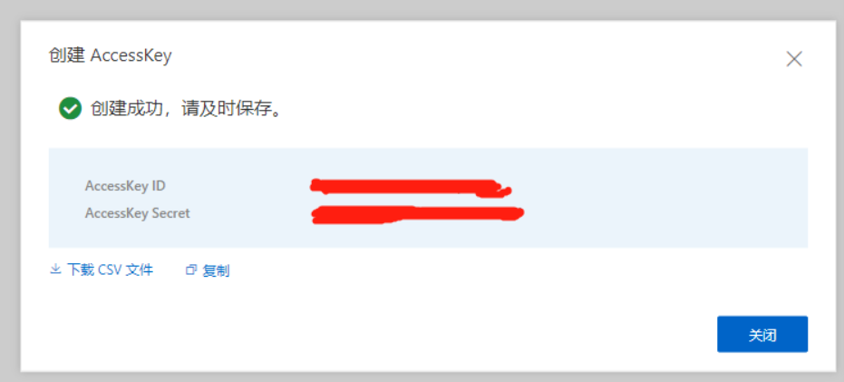

使用子用户 AccessKey（更安全，但步骤繁琐）

如果要用子用户 AccessKey，那么选择【开始使用子用户 AccessKey】即可。

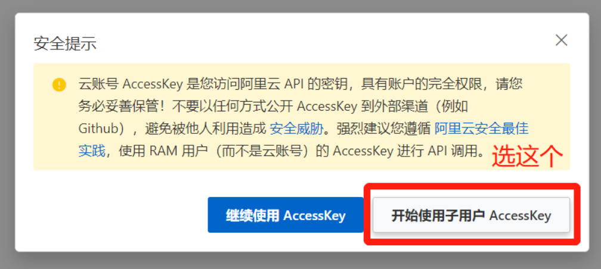

第一步：创建并填写用户信息
点击【创建用户】按钮：

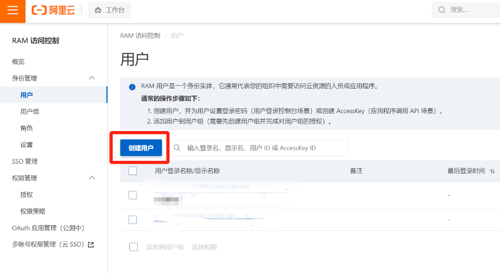

点击之后需要填写用户信息：

设置登录名称：pot
填写显示名称：pot
访问方式：勾选【Open API 调用访问】。
完成之后点击【确定】。

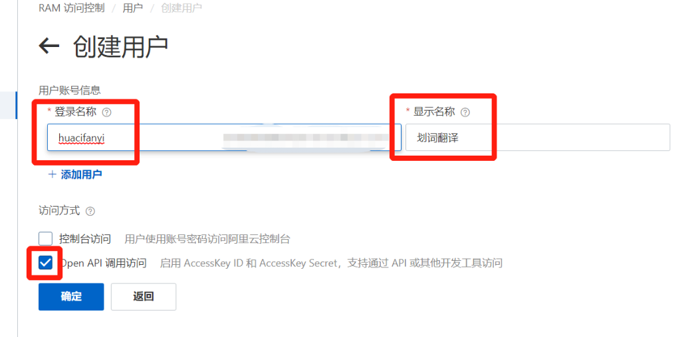

点击之后会让你输入手机短信验证码，输入之后会看到创建成功的 【AccessKey ID】 和 【AccessKey Secret】，如下图：

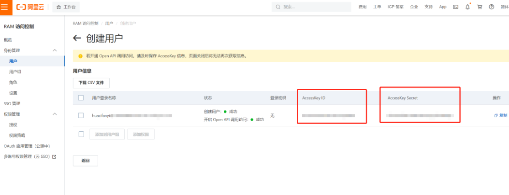

第二步：设置用户权限
勾选刚刚创建的用户并点击【添加权限】：

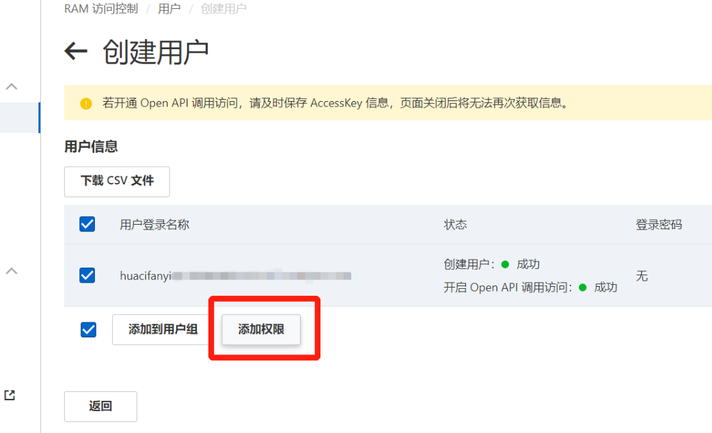

搜索“机器翻译”，单击选中【AliyunMTFullAccess】和【AliyunMTReadOnlyAccess】这两项即可，然后点击【确定】：

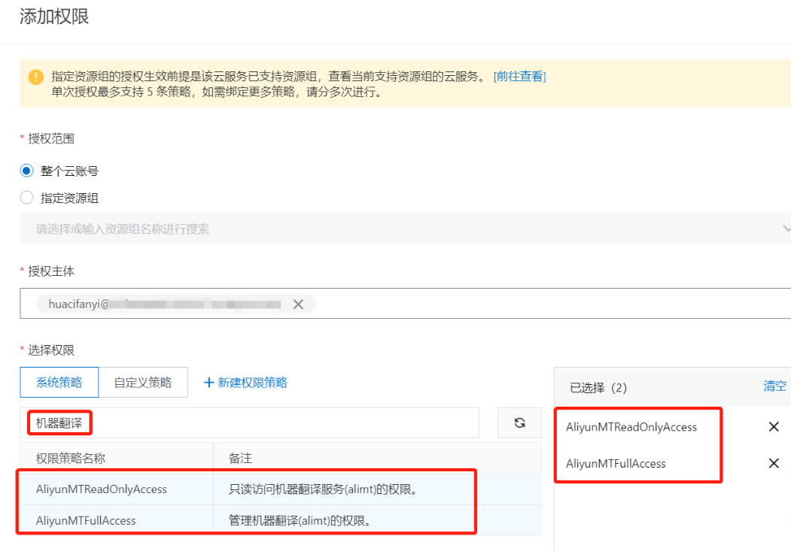

第三步：审阅信息
这一步只需要点击【完成】按钮即可，然后就会看到这个子账户的【AccessKey ID】 和 【AccessKey Secret】，如下图：

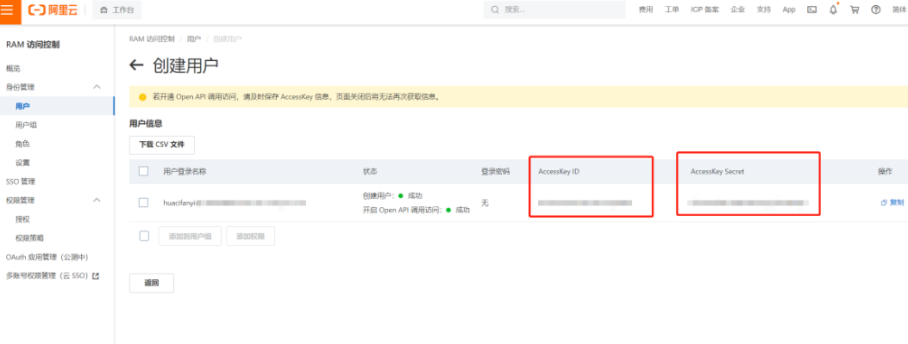

### 第三步：在 pot 中填写 AccessKey

将上图中的【AccessKey ID】和【AccessKey Secret】填写进 pot 的【设置页】-【接口设置】-【阿里翻译】中即可。

## 相关链接

[阿里云通用版翻译引擎介绍](https://www.aliyun.com/product/ai/base_alimt)

[阿里云机器翻译通用版定价文档](https://help.aliyun.com/document_detail/158294.html)
