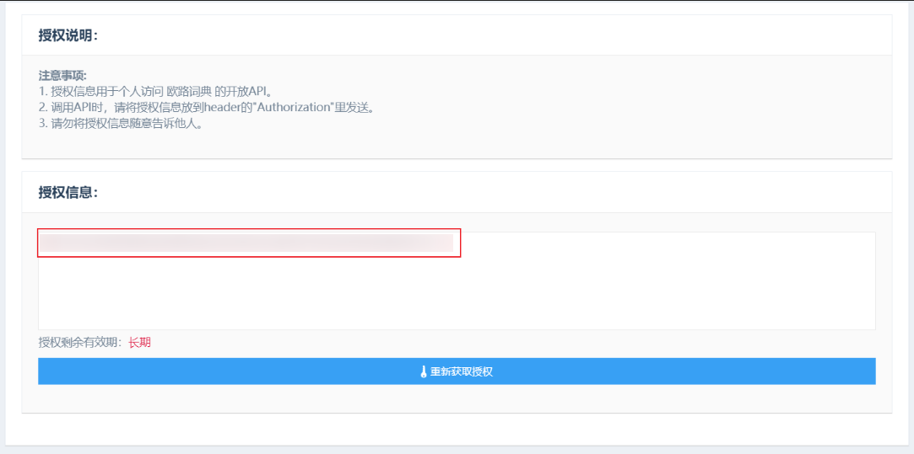
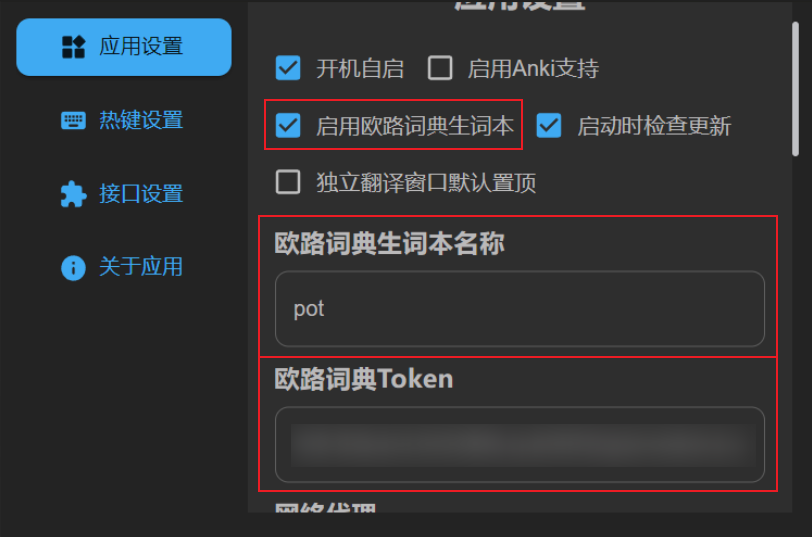

# 欧路词典

## 获取欧路词典用户 Token

1. 打开[授权页面](http://my.eudic.net/OpenAPI/Authorization)

2. 登录欧路词典账号

3. 复制下方的授权信息

   

4. 将授权信息粘贴到 pot 的设置中

## 设置单词本名称

你可以置顶 pot 将将内容添加到哪个单词本，可以是不存在的单词本名称，pot 会自动创建新的单词本，默认名称为`pot`

## 在 Pot 中启用欧路词典生词本

1. Pot-设置-应用设置-启用欧路词典生词本

   

2. 配置完成之后，翻译面板会出现添加到欧路词典生词本图标，点击即可将本次翻译内容添加到 欧路词典生词本。

   

> 注意，由于欧路词典 API 只支持添加生词，而不能添加生词的翻译，所以添加之后在欧路词典中查看时的翻译由欧路词典提供

