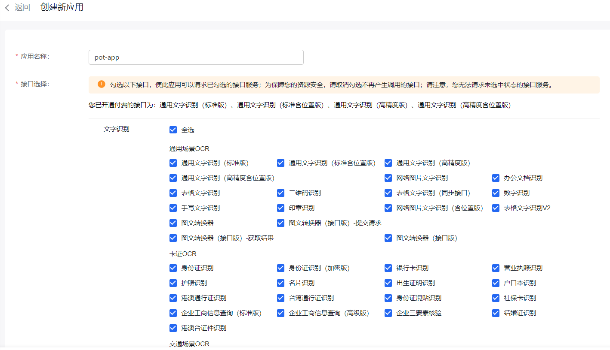
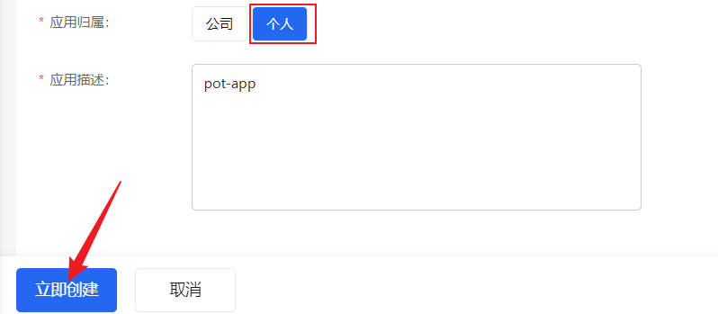
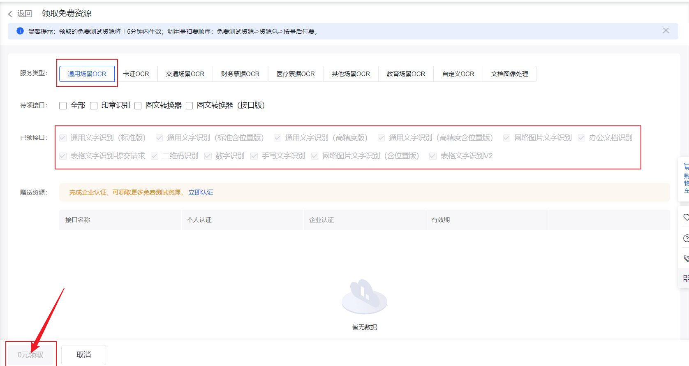
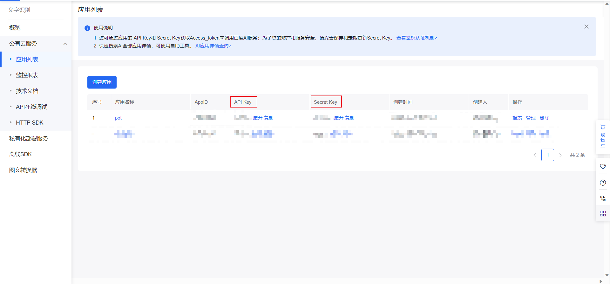

# 百度 OCR

:::info
文档内容可能会过时，请以 百度 OCR 官网说明为准。
:::

## 价格

- 通用文字识别（标准版）

在 控制台-免费资源领取页 可领取所需接口的免费测试资源。个人认证 1,000 次/月，企业认证 2,000 次/月。

- 通用文字识别（高精度版）

在 控制台-免费资源领取页 可领取所需接口的免费测试资源。个人认证 1,000 次/月，企业认证 2,000 次/月。

- 按需付费

免费额度用完之后可以选择按需付费，具体定价参考百度 OCR[定价说明](https://ai.baidu.com/ai-doc/OCR/9k3h7xuv6)

## 申请步骤

### 第一步：注册登录

前往[官网](https://ai.baidu.com/)注册并登录

前往[个人中心](https://console.bce.baidu.com/iam/#/iam/baseinfo)进行实名认证（没有实名认证的账号免费额度会低很多）

### 第二步：创建应用

前往[控制台-文字识别](https://console.bce.baidu.com/ai/#/ai/ocr/overview/index)

点击创建应用

### 第三步：领取资源包

必须要领取资源包之后才会有免费额度

前往[领取页面](https://console.bce.baidu.com/ai/#/ai/ocr/overview/resource/getFree)领取所需资源包

### 第四步：获取密钥

前往[应用列表](https://console.bce.baidu.com/ai/#/ai/ocr/app/list),找到刚刚创建的应用，复制对应的密钥：

### 第五步：将密钥填入 pot 设置

将复制的 API Key 和 Secret Key 填入 pot 的【设置页】-【接口设置】-【OCR 接口】中对应位置即可。

## 相关链接

[百度 OCR](https://ai.baidu.com/tech/ocr/general)

[百度 OCR 定价文档](https://ai.baidu.com/ai-doc/OCR/9k3h7xuv6)

