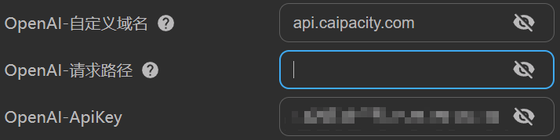

# OpenAI

:::info
教程来源于[划词翻译](https://hcfy.app/)，一个很棒的网页翻译插件

文档内容可能会过时，请以 OpenAI 官网说明为准。
:::

## 价格

OpenAI API（gpt-3.5-turbo）一次性提供 5 美元的免费额度，而它的价格为 0.002 美元 / 1000 tokens，其中 1000 tokens 大约为 750 个英文单词。有关 “token” 的详细解释见 OpenAI 文档：[Managing tokens](https://platform.openai.com/docs/guides/chat/managing-tokens)

> 注意：OpenAI 提供的免费额度是会在三个月后过期清零的，具体过期时间可以在 [https://platform.openai.com/account/usage](https://platform.openai.com/account/usage) 查看。

## 申请步骤

### 第一步：准备一个 OpenAI 账号

请自行准备一个 OpenAI 账号。

### 第二步：创建 Secret Key

打开 https://platform.openai.com/account/api-keys，如果没登录的话会让你登录
点击【Create new secret key】按钮，会出现一个弹窗，里面显示了 Secret Key
复制 Secret Key

### 第三步：在 pot 中填写 OpenAI 的 Secret Key

将 Secret Key 填写进 pot 的【设置页】-【接口设置】-【Open AI ApiKey】即可。

## 关于 Open AI api 连接不上的解决方案

### 方法 1：通过 Cloudflare 反向代理

参考 [chatgptProxyAPI](https://github.com/x-dr/chatgptProxyAPI)

pot 已经提供了自定义域名的设置，在设置中填写你自己的域名即可。

### 方法 2：开启代理

pot 提供了软件内代理设置(软件内代理对 OpenAI 流式输出无效，若使用流式输出需要开启系统代理)

### 方法 3：使用第三方服务

由于本应用支持设置自定义请求域名，所有您可以直接设置使用第三方的服务

#### aiproxy

1. 注册 [aiproxy](https://aiproxy.io/?i=pylogmon)
2. 获取 Api Key
3. 将自定义域名设置为`api.aiproxy.io`
4. 在设置中填入获取到的 `Api Key`

   

:::info
使用 aiproxy 的计费请参考 aiproxy 的[计费说明](https://aiproxy.io/pricing)
:::

#### AI.LS

1. 打开[AI.LS](https://ai.ls/)官网
2. 点击右边的`Get API Key/Tokens`,输入邮箱后购买
3. 在 pot 中将自定义域名设置为`api.caipacity.com`
4. 在设置中填入邮箱收到的 `Api Key`

   

:::info
使用 AI.LS 的计费请参考 AI.LS 的[计费说明](https://ai.ls/?show-token-pricing=true)
:::

#### API2D

1. 注册 [API2D](https://api2d.com/r/186163)
2. 获取 ForwardKey
3. 将自定义域名设置为`openai.api2d.net`
4. 在设置中填入`ForwardKey`

   

:::info
使用 API2D 的计费请参考 API2D 的[计费说明](https://api2d.com/wiki/doc)
:::

## 相关链接

[OpenAI 开放平台](https://platform.openai.com/)

[GhatGPT API（gpt-3.5-turbo）定价文档](https://openai.com/pricing)

