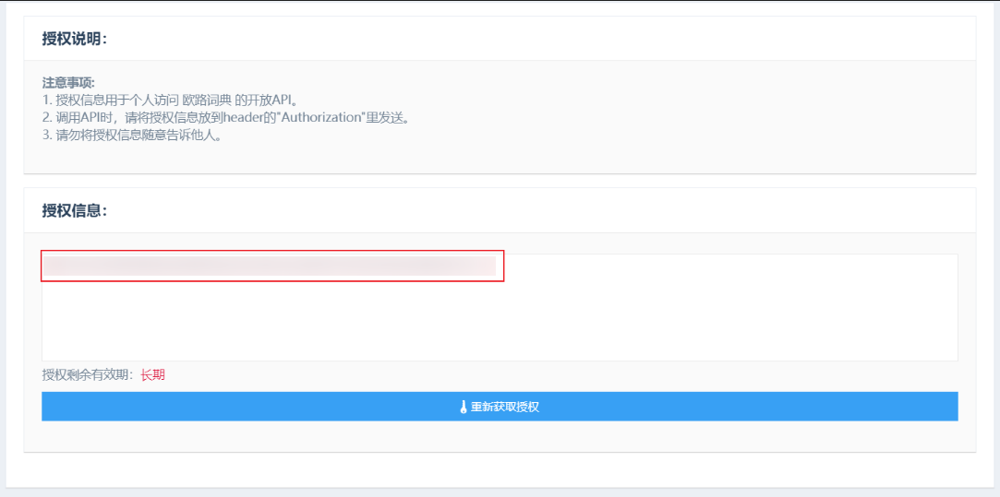
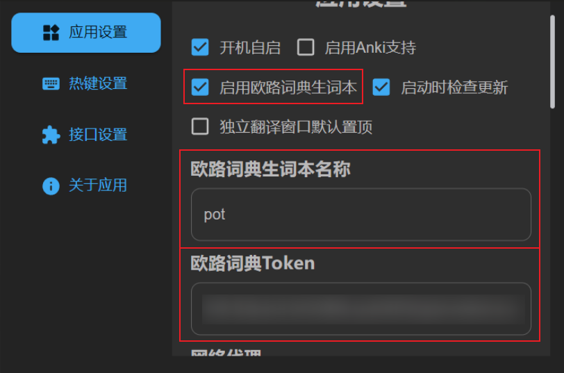

# 外联设置

## Anki

由于 AnkiWeb 并没有开放的 API，所以要支持 Anki 只能通过 Anki 客户端插件 `AnkiConnect`

### 配置步骤

### 安装 `AnkiConnect` 插件

1. 打开 Anki 客户端
2. 工具-插件-获取插件
3. 填入 `AnkiConnect` 插件 id `2055492159`，确认后安装
4. 重启 Anki 客户端生效
   更多 `AnkiConnect` 相关信息可以查阅[AnkiConnect 官网](https://foosoft.net/projects/anki-connect/)

### 安装 `Minimize to tray` 插件(可选)

由于 `AnkiConnect` 需要 Anki 客户端保持运行，而 Anki 客户端又没有后台运行的功能，所以需要借助插件使其可以最小化到托盘

1. 打开 Anki 客户端
2. 工具-插件-获取插件
3. 填入 `Minimize to tray` 插件 id `85158043`，确认后安装
4. 重启 Anki 客户端生效

### 在 Pot 中启用 Anki 支持

1. Pot-设置-应用设置-启用 Anki 支持

配置完成之后，翻译面板会出现添加到 Anki 图标，点击即可将本次翻译内容添加到 Anki。

> 注意需要 Anki 客户端保持后台运行

## 添加到欧路词典生词本设置

### 获取欧路词典用户 Token

1. 打开[授权页面](http://my.eudic.net/OpenAPI/Authorization)

2. 登录欧路词典账号

3. 复制下方的授权信息

   

4. 将授权信息粘贴到 pot 的设置中

### 设置单词本名称

你可以置顶 pot 将将内容添加到哪个单词本，可以是不存在的单词本名称，pot 会自动创建新的单词本，默认名称为`pot`

### 在 Pot 中启用欧路词典生词本

1. Pot-设置-应用设置-启用欧路词典生词本

   

2. 配置完成之后，翻译面板会出现添加到欧路词典生词本图标，点击即可将本次翻译内容添加到 欧路词典生词本。

   

> 注意，由于欧路词典 API 只支持添加生词，而不能添加生词的翻译，所以添加之后在欧路词典中查看时的翻译由欧路词典提供
