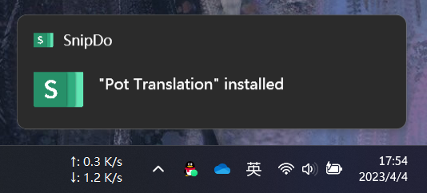
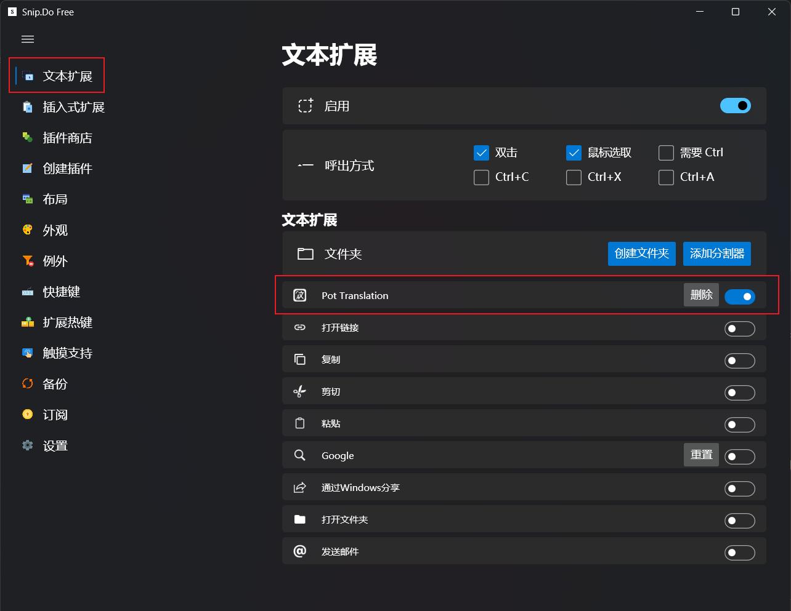
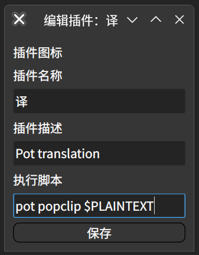

import Link from "@docusaurus/Link";
import { BsDownload } from "react-icons/bs";

# 外部调用

Pot 提供了完整的 HTTP 接口，以便可以被其他软件调用。您可以通过向 `127.0.0.1:port` 发送 HTTP 请求来调用 pot，其中的`port`是 pot 监听的端口号，默认为`60828`,可以在软件设置中进行更改。

## API 文档:

```bash
POST "/" => 翻译指定文本(body为需要翻译的文本),
GET "/config" => 打开设置,
GET "/translate" => 翻译指定文本(同"/"),
GET "/selection_translate" => 划词翻译,
GET "/input_translate" => 输入翻译,
GET "/ocr_recognize" => 截图OCR,
GET "/ocr_translate" => 截图翻译,
GET "/ocr_recognize?screenshot=false" => 截图OCR(不使用软件内截图),
GET "/ocr_translate?screenshot=false" => 截图翻译(不使用软件内截图),
GET "/ocr_recognize?screenshot=true" => 截图OCR,
GET "/ocr_translate?screenshot=true" => 截图翻译,
```

## 示例：

- 调用划词翻译：

  如果想要调用 pot 划词翻译，只需向`127.0.0.1:port`发送请求即可。

  例如通过 curl 发送请求：

  ```bash
  curl "127.0.0.1:60828/selection_translate"
  ```

## 不使用软件内截图

这一功能可以让您在不使用软件内截图的情况下调用截图 OCR/截图翻译功能，这样您就可以使用您喜欢的截图工具来截图了，也可以解决在某些平台下 pot 自带的截图无法使用的问题。

### 调用流程

1. 使用其他截图工具截图
2. 将截图保存在 `$CACHE/com.pot-app.desktop/pot_screenshot_cut.png`
3. 向`127.0.0.1:port/ocr_recognize?screenshot=false`发送请求即可调用成功

> `$CACHE`为系统缓存目录，例如在 Windows 上为`C:\Users\{用户名}\AppData\Local\com.pot-app.desktop\pot_screenshot_cut.png`

### 示例

在 Linux 下调用 Flameshot 进行截图 OCR:

```bash
rm ~/.cache/com.pot-app.desktop/pot_screenshot_cut.png && flameshot gui -s -p ~/.cache/com.pot-app.desktop/pot_screenshot_cut.png && curl "127.0.0.1:60828/ocr_recognize?screenshot=false"
```

## 现有用法 (快捷划词翻译)

### SnipDo(Windows)

1. 在 [Microsoft Store](https://www.microsoft.com/store/productId/9NPZ2TVKJVT7) 下载安装 SnipDo

2. 下载 pot 的 `SnipDo` 扩展:

   <Link
     className="button button--primary button--lg"
     to="https://ghproxy.com/https://github.com/pot-app/pot-desktop/releases/latest/download/pot.pbar"
   >
     <div style={{ display: "flex", justifyContent: "space-between" }}>
       <BsDownload style={{ margin: "auto", marginRight: "14px" }} />
       <span>点击下载</span>
     </div>
   </Link>

3. 双击安装，出现安装成功即可使用

   

4. 如果划词后不出现图标可以去软件设置中启用 pot:

   

### PopClip(MacOS)

1. 安装 [PopClip](https://pilotmoon.com/popclip/)
2. 下载 pot 的 `PopClip` 插件:

   <Link
     className="button button--primary button--lg"
     to="https://ghproxy.com/https://github.com/pot-app/pot-desktop/releases/latest/download/Pot.popclipextz"
   >
     <div style={{ display: "flex", justifyContent: "space-between" }}>
       <BsDownload style={{ margin: "auto", marginRight: "14px" }} />
       <span>点击下载</span>
     </div>
   </Link>

3. 安装下载的插件
4. 在 PopClip 菜单中启用 Pot 插件

### Starry(Linux)

1. 安装 [Starry](https://github.com/ccslykx/Starry)
2. 打开 Starry-设置-新建插件
3. 名称及说明任意填写，在 `执行脚本` 处填 `pot popclip $PLAINTEXT` 或 `curl 'http://127.0.0.1:60828' -X POST -d $PLAINTEXT`。

   

4. 保存后关闭窗口，即可划词后出现快捷按钮。

:::info
注意，Starry 还处于开发阶段，只能自己编译体验。
:::

<div
  class="wwads-cn wwads-vertical wwads-sticky"
  data-id="285"
  style={{ maxWidth: "180px" }}
></div>
