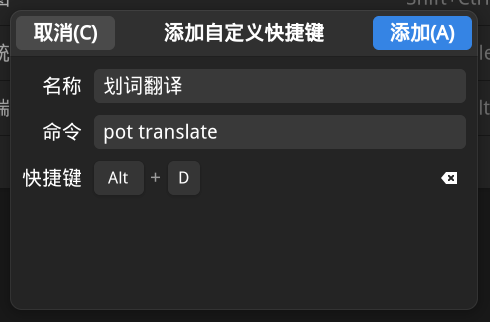

# Wayland

由于各大发行版对于 Wayland 的支持程度不同，所以 pot 本身没法做到特别完美的支持，这里可以提供一些常见问题的解决方案，通过合理的设置之后，pot 也可以在 wayland 下完美运行。

## 快捷键

由于 Tauri 的快捷键方案并没有支持 Wayland，所以 pot 应用内的快捷键设置在 Wayland 下无法使用。
针对这一问题 pot 提供了命令行启动参数，可以通过命令来设置系统快捷键。

> 所有命令都需要 pot 保持后台运行

```bash
pot cofig # 启动pot设置
pot persistent # 启动输入翻译窗口
pot translate # 划词翻译
pot screenshot_ocr # 截图OCR
pot screenshot_translate # 截图翻译
pot screenshot_ocr without_screenshot # 截图OCR(不使用pot截图)
pot screenshot_translate without_screenshot # 截图翻译(不使用pot截图)
```

Gnome 设置示例：


## 截图无法使用

在一些纯 Wayland 桌面环境/窗口管理器(如 Hyprland)上，pot 内置的截图无法使用，这时可以通过命令行参数来使用其他截图工具代替，只要实现截图后保存在 `~/.cache/com.pylogmon.pot/pot_screenshot_cut.png` 后再执行 `pot screenshot_ocr without_screenshot` 即可。

下面给出在 Hyprland 下的配置示例(通过 grim 和 slurp 实现截图)：

```conf
bind = ALT, X, exec, grim -g "$(slurp)" ~/.cache/com.pylogmon.pot/pot_screenshot_cut.png && pot screenshot_ocr without_screenshot
bind = ALT, C, exec, grim -g "$(slurp)" ~/.cache/com.pylogmon.pot/pot_screenshot_cut.png && pot screenshot_translate without_screenshot
```

其他桌面环境/窗口管理器也是类似的操作

## 划词翻译窗口跟随鼠标位置

由于目前 pot 在 Wayland 下还无法获取到正确的鼠标坐标，所以内部的实现无法工作。
对于某些桌面环境/窗口管理器，可以通过设置窗口规则来实现窗口跟随鼠标位置，这里以 Hyprland 为例：

```conf
windowrulev2 = float, class:(pot), title:(Translator|OCR|PopClip|Screenshot Translate) # 翻译窗口浮动
windowrulev2 = move cursor 0 0, class:(pot), title:(Translator|PopClip|Screenshot Translate) # 翻译窗口跟随鼠标位置
```
